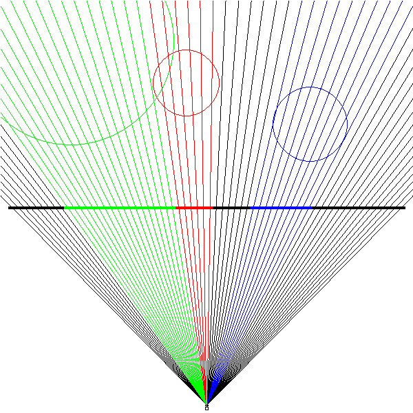

# rustrace
A 2D to 1D ray tracer visualizer written in rust and compiled to wasm/asmjs.
You can give it a try [here](https://turbio.github.io/rustrace/).

## Building and Running
(assuming you have the rust toolchain and yarn installed)

Just run `yarn` and `yarn compile` in this repo's root.  
You can then run `yarn serve` and open it up in your browser.
